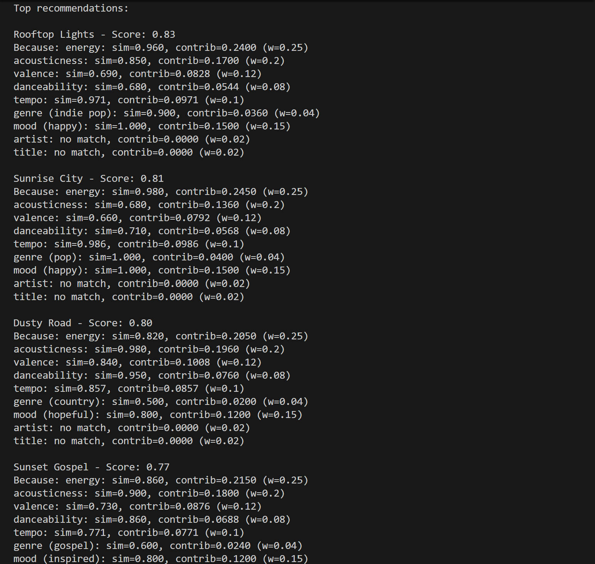
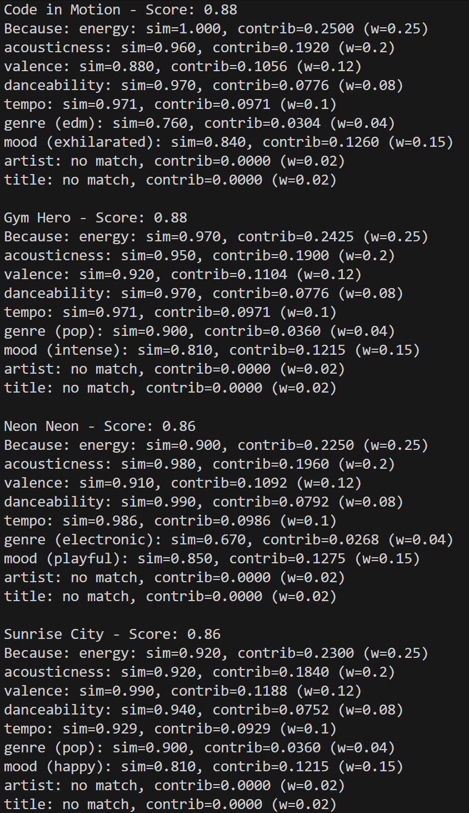
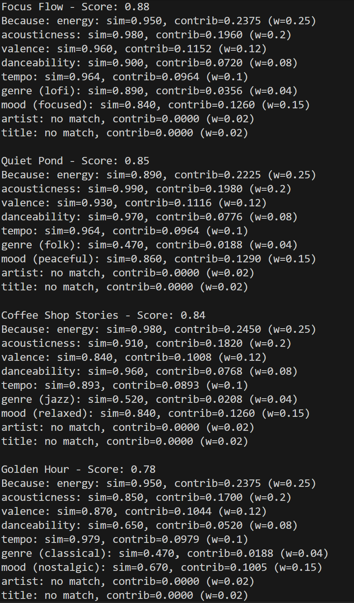
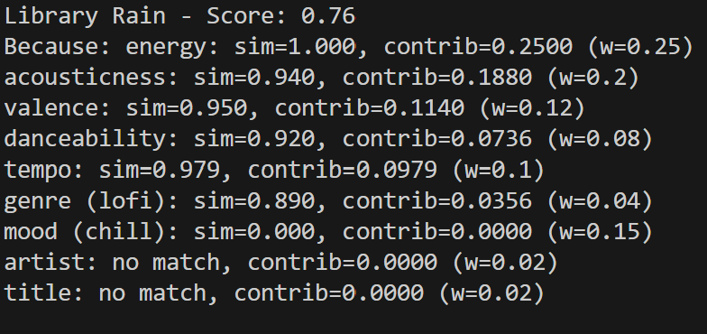
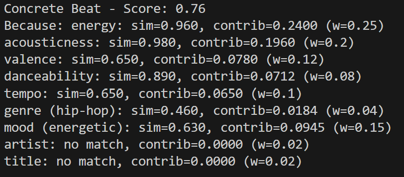
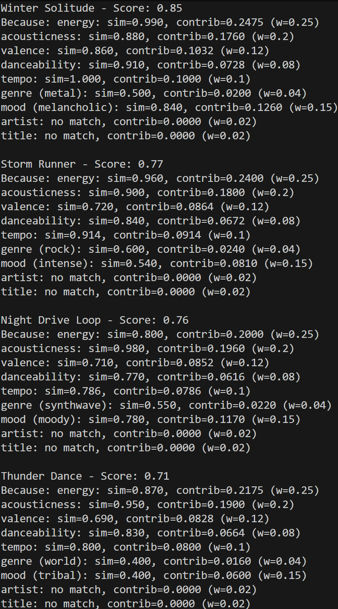
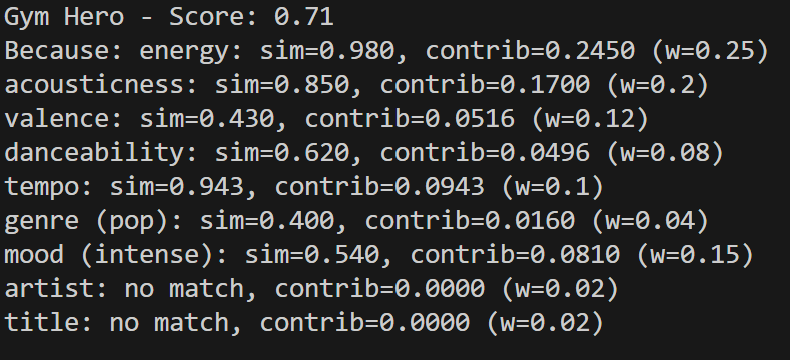
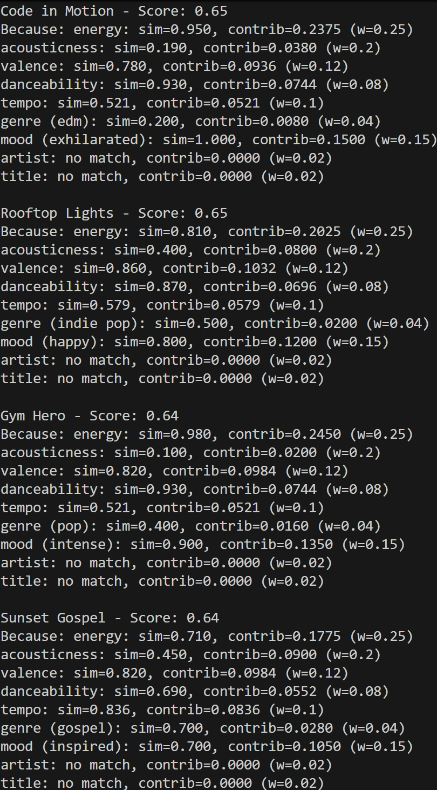

# 🎵 Music Recommender Simulation

## Project Summary

In this project you will build and explain a small music recommender system.

Your goal is to:

- Represent songs and a user "taste profile" as data
- Design a scoring rule that turns that data into recommendations
- Evaluate what your system gets right and wrong
- Reflect on how this mirrors real world AI recommenders

Replace this paragraph with your own summary of what your version does.

---

## How The System Works

### Features to Use

The features I will focus on will be (order in importance):
  - Energy
  - Acousticness
  - Mood
  - Valence
  - Tempo
  - Danceability
  - Genre
  - Artist
  - Title

Features like artist and title make sense to exclude, given the amount of data we have available, but will include them but have them ranked in the bottom with a low weighting.

### Weighted Scoring Formula
Overall song score = sum(weight * similarity for each feature). Weights sum to 1, based on ranking:
- Energy: 0.25
- Acousticness: 0.20
- Mood: 0.15
- Valence: 0.12
- Tempo: 0.10
- Danceability: 0.08
- Genre: 0.04
- Artist: 0.02
- Title: 0.02

### Similarity Scores Formulas
- **Numerical features (energy, acousticness, valence, tempo, danceability)**: Use `similarity = 1 - |song_value - user_preferred|`. For tempo (in BPM, not 0-1), normalize: `similarity = 1 - |tempo - pref| / (max_tempo - min_tempo)` (e.g., min=60, max=200).

- **Categorical features**:
  - **Genre and Mood**: Use fuzzy similarity matrices (based on relatedness, 0-1 scale).
  - **Artist**: Exact match: `similarity = 1` if same artist, else `0`.
  - **Title**: Exact match: `similarity = 1` if same title, else `0`.


### Similarity Matrix for Categorical Features
Since different moods and genres can be similar in the type of songs, having a discrete 1 or 0 if they equal or not wouldn't make sense, so having fuzzy matching based on relatedness makes more sense. Here they are:

#### Genre Similarity Matrix
(17x17, unique genres: ambient, classical, country, edm, electronic, folk, gospel, hip-hop, indie pop, jazz, lofi, metal, pop, reggae, rock, synthwave, world)

| Genre      | ambient | classical | country | edm | electronic | folk | gospel | hip-hop | indie pop | jazz | lofi | metal | pop | reggae | rock | synthwave | world |
|------------|---------|-----------|---------|-----|------------|------|--------|----------|-----------|------|------|-------|-----|--------|------|----------|-------|
| ambient   | 1.0    | 0.5      | 0.3    | 0.5 | 0.6       | 0.4 | 0.3   | 0.2     | 0.3      | 0.4 | 0.8 | 0.1  | 0.2 | 0.3   | 0.2 | 0.7     | 0.4  |
| classical | 0.5    | 1.0      | 0.4    | 0.2 | 0.3       | 0.6 | 0.7   | 0.1     | 0.5      | 0.8 | 0.4 | 0.2  | 0.4 | 0.3   | 0.3 | 0.2     | 0.5  |
| country   | 0.3    | 0.4      | 1.0    | 0.2 | 0.2       | 0.8 | 0.5   | 0.3     | 0.6      | 0.4 | 0.3 | 0.4  | 0.5 | 0.4   | 0.7 | 0.1     | 0.4  |
| edm       | 0.5    | 0.2      | 0.2    | 1.0 | 0.9       | 0.2 | 0.3   | 0.6     | 0.4      | 0.2 | 0.4 | 0.3  | 0.7 | 0.4   | 0.4 | 0.8     | 0.3  |
| electronic| 0.6    | 0.3      | 0.2    | 0.9 | 1.0       | 0.3 | 0.3   | 0.5     | 0.4      | 0.3 | 0.5 | 0.3  | 0.6 | 0.4   | 0.4 | 0.8     | 0.4  |
| folk      | 0.4    | 0.6      | 0.8    | 0.2 | 0.3       | 1.0 | 0.5   | 0.2     | 0.7      | 0.5 | 0.5 | 0.3  | 0.5 | 0.4   | 0.6 | 0.2     | 0.5  |
| gospel    | 0.3    | 0.7      | 0.5    | 0.3 | 0.3       | 0.5 | 1.0   | 0.4     | 0.5      | 0.8 | 0.3 | 0.2  | 0.6 | 0.5   | 0.4 | 0.2     | 0.7  |
| hip-hop   | 0.2    | 0.1      | 0.3    | 0.6 | 0.5       | 0.2 | 0.4   | 1.0     | 0.5      | 0.3 | 0.3 | 0.4  | 0.8 | 0.7   | 0.5 | 0.4     | 0.5  |
| indie pop | 0.3    | 0.5      | 0.6    | 0.4 | 0.4       | 0.7 | 0.5   | 0.5     | 1.0      | 0.6 | 0.4 | 0.5  | 0.9 | 0.4   | 0.7 | 0.4     | 0.4  |
| jazz      | 0.4    | 0.8      | 0.4    | 0.2 | 0.3       | 0.5 | 0.8   | 0.3     | 0.6      | 1.0 | 0.5 | 0.2  | 0.5 | 0.4   | 0.4 | 0.3     | 0.6  |
| lofi      | 0.8    | 0.4      | 0.3    | 0.4 | 0.5       | 0.5 | 0.3   | 0.3     | 0.4      | 0.5 | 1.0 | 0.2  | 0.3 | 0.3   | 0.3 | 0.5     | 0.4  |
| metal     | 0.1    | 0.2      | 0.4    | 0.3 | 0.3       | 0.3 | 0.2   | 0.4     | 0.5      | 0.2 | 0.2 | 1.0  | 0.4 | 0.2   | 0.9 | 0.3     | 0.3  |
| pop       | 0.2    | 0.4      | 0.5    | 0.7 | 0.6       | 0.5 | 0.6   | 0.8     | 0.9      | 0.5 | 0.3 | 0.4  | 1.0 | 0.5   | 0.6 | 0.6     | 0.4  |
| reggae    | 0.3    | 0.3      | 0.4    | 0.4 | 0.4       | 0.4 | 0.5   | 0.7     | 0.4      | 0.4 | 0.3 | 0.2  | 0.5 | 1.0   | 0.3 | 0.3     | 0.8  |
| rock      | 0.2    | 0.3      | 0.7    | 0.4 | 0.4       | 0.6 | 0.4   | 0.5     | 0.7      | 0.4 | 0.3 | 0.9  | 0.6 | 0.3   | 1.0 | 0.4     | 0.4  |
| synthwave | 0.7    | 0.2      | 0.1    | 0.8 | 0.8       | 0.2 | 0.2   | 0.4     | 0.4      | 0.3 | 0.5 | 0.3  | 0.6 | 0.3   | 0.4 | 1.0     | 0.3  |
| world     | 0.4    | 0.5      | 0.4    | 0.3 | 0.4       | 0.5 | 0.7   | 0.5     | 0.4      | 0.6 | 0.4 | 0.3  | 0.4 | 0.8   | 0.4 | 0.3     | 1.0  |

#### Mood Similarity Matrix
(16x16, unique moods: chill, energetic, exhilarated, focused, happy, hopeful, inspired, intense, laid-back, melancholic, moody, nostalgic, peaceful, playful, relaxed, tribal)

| Mood       | chill | energetic | exhilarated | focused | happy | hopeful | inspired | intense | laid-back | melancholic | moody | nostalgic | peaceful | playful | relaxed | tribal |
|------------|-------|-----------|-------------|---------|-------|---------|----------|---------|-----------|-------------|-------|-----------|----------|---------|---------|--------|
| chill     | 1.0  | 0.4      | 0.3        | 0.8    | 0.5  | 0.6    | 0.5     | 0.3    | 0.9      | 0.6        | 0.7  | 0.7      | 0.9     | 0.4    | 0.9    | 0.4   |
| energetic | 0.4  | 1.0      | 0.8        | 0.6    | 0.7  | 0.7    | 0.6     | 0.9    | 0.5      | 0.3        | 0.4  | 0.4      | 0.4     | 0.8    | 0.5    | 0.6   |
| exhilarated| 0.3  | 0.8      | 1.0        | 0.5    | 0.8  | 0.7    | 0.7     | 0.9    | 0.4      | 0.2        | 0.3  | 0.3      | 0.3     | 0.9    | 0.4    | 0.5   |
| focused   | 0.8  | 0.6      | 0.5        | 1.0    | 0.4  | 0.6    | 0.6     | 0.5    | 0.7      | 0.5        | 0.6  | 0.6      | 0.7     | 0.4    | 0.7    | 0.4   |
| happy     | 0.5  | 0.7      | 0.8        | 0.4    | 1.0  | 0.8    | 0.8     | 0.6    | 0.6      | 0.3        | 0.4  | 0.5      | 0.5     | 0.9    | 0.6    | 0.5   |
| hopeful   | 0.6  | 0.7      | 0.7        | 0.6    | 0.8  | 1.0    | 0.9     | 0.5    | 0.6      | 0.4        | 0.5  | 0.7      | 0.6     | 0.7    | 0.7    | 0.5   |
| inspired  | 0.5  | 0.6      | 0.7        | 0.6    | 0.8  | 0.9    | 1.0     | 0.5    | 0.5      | 0.4        | 0.5  | 0.8      | 0.5     | 0.7    | 0.6    | 0.6   |
| intense   | 0.3  | 0.9      | 0.9        | 0.5    | 0.6  | 0.5    | 0.5     | 1.0    | 0.4      | 0.7        | 0.8  | 0.4      | 0.3     | 0.6    | 0.4    | 0.7   |
| laid-back | 0.9  | 0.5      | 0.4        | 0.7    | 0.6  | 0.6    | 0.5     | 0.4    | 1.0      | 0.5        | 0.6  | 0.6      | 0.8     | 0.5    | 0.9    | 0.5   |
| melancholic| 0.6  | 0.3      | 0.2        | 0.5    | 0.3  | 0.4    | 0.4     | 0.7    | 0.5      | 1.0        | 0.9  | 0.7      | 0.6     | 0.2    | 0.5    | 0.4   |
| moody     | 0.7  | 0.4      | 0.3        | 0.6    | 0.4  | 0.5    | 0.5     | 0.8    | 0.6      | 0.9        | 1.0  | 0.6      | 0.6     | 0.3    | 0.6    | 0.5   |
| nostalgic | 0.7  | 0.4      | 0.3        | 0.6    | 0.5  | 0.7    | 0.8     | 0.4    | 0.6      | 0.7        | 0.6  | 1.0      | 0.7     | 0.4    | 0.7    | 0.5   |
| peaceful  | 0.9  | 0.4      | 0.3        | 0.7    | 0.5  | 0.6    | 0.5     | 0.3    | 0.8      | 0.6        | 0.6  | 0.7      | 1.0     | 0.4    | 0.9    | 0.4   |
| playful   | 0.4  | 0.8      | 0.9        | 0.4    | 0.9  | 0.7    | 0.7     | 0.6    | 0.5      | 0.2        | 0.3  | 0.4      | 0.4     | 1.0    | 0.5    | 0.6   |
| relaxed   | 0.9  | 0.5      | 0.4        | 0.7    | 0.6  | 0.7    | 0.6     | 0.4    | 0.9      | 0.5        | 0.6  | 0.7      | 0.9     | 0.5    | 1.0    | 0.5   |
| tribal    | 0.4  | 0.6      | 0.5        | 0.4    | 0.5  | 0.5    | 0.6     | 0.7    | 0.5      | 0.4        | 0.5  | 0.5      | 0.4     | 0.6    | 0.5    | 1.0   |

### User Profile Information
User profile should have their own scores like preferred_energy, preferred_valence, preferred_acousticness, preferred_tempo, preferred_danceability, preferred_genres, and preferred_moods. These should be scores on the range of [0, 1] (for numerical features) and categorical sets for genre/mood.

Example:

```python
user_profile = {
    'preferred_energy': 0.8,
    'preferred_valence': 0.7,
    'preferred_acousticness': 0.3,
    'preferred_tempo': 120,
    'preferred_danceability': 0.6,
    'preferred_genres': {'pop': 0.5, 'rock': 0.3, 'electronic': 0.2},
    'preferred_moods': {'happy': 0.4, 'energetic': 0.3, 'chill': 0.3},
    'favorite_artist': 'Neon Echo',
    'favorite_genre': 'pop',
    'favorite_mood': 'happy'
}
```

#### Mathematical profile update rule
For numeric features, use an exponential moving average (EMA) update after each user action:

- `pref_new = (1 - \alpha) * pref_old + \alpha * song_value`
- `\alpha` in (0,1] is the learning rate (e.g., 0.1)

Example for energy on a like:

- `pref_energy_new = 0.9 * pref_energy_old + 0.1 * song_energy`

For negative signals (skip/dislike), push away:

- `pref_energy_new = pref_energy_old + \beta * (pref_energy_old - song_energy)`

or just reduce weight by decreasing confidence and normalizing.

For categorical preferences, use counts and soft probabilities:

- `genre_score[genre] += 1` on like, `-= 1` on skip (floor 0)
- normalize to probabilities in [0,1]

#### Ranking rule (song list)
Compute `overall_score` for each candidate song, then sort by descending score:

- `ranked_songs = sorted(songs, key=lambda s: s.overall_score, reverse=True)`

This is the core pipeline: profile update → scoring rule → ranking rule.

### Which songs are chosen? (ranking system)
Based on the similarity scores and weighting system. They should lead to different scores that allows for a ranking system to be used to order songs in how related they are to the user's profile.

Here is an example of it:




### Potential Biases
- Data representation bias: Song catalog may underrepresent diverse genres, artists, or cultures, favoring mainstream options.
Feature weighting bias: Heavier emphasis on features like energy can marginalize calmer or niche songs.

- Similarity matrix bias: Subjective genre/mood relatedness may undervalue emerging or hybrid styles.

- User profile echo chamber: Updates reinforce existing preferences, limiting exposure to new music.

- Cold start bias: New users/songs lack data, leading to suboptimal recommendations.

- Interaction interpretation bias: Skips treated as dislikes may misinterpret user intent.

- Demographic bias: Dataset reflecting specific tastes can exclude or unfairly serve other groups.


---

## Getting Started

### Setup

1. Create a virtual environment (optional but recommended):

   ```bash
   python -m venv .venv
   source .venv/bin/activate      # Mac or Linux
   .venv\Scripts\activate         # Windows

2. Install dependencies

```bash
pip install -r requirements.txt
```

3. Run the app:

```bash
python -m src.main
```

### Running Tests

Run the starter tests with:

```bash
pytest
```

You can add more tests in `tests/test_recommender.py`.

---

## Experiments You Tried

Here, I tried multiple experiments such as removing a feature, changing the weight of a feature(s), or trying different edge cases of user profiles. Further discussion is in the model card.

### Feature Removal
Removed danceability (weight=0.08) to see if it had any effect on the recommendations. My prediction was that it wouldn't since it had a lower weight compared to other features. However, there were some changes to "Dead Center" and "Chill Lofi", which points to the idea of danceability being a tiebreaker for some songs. So, lower weighted features are important, by acting as tiebreakers when higher weighted features' scores are tied.

### Weight Change
Changed weights of energy (weight=0.25) and mood (weight=0.15). This made a difference in "Conflicting Energy/Mood" since originally energy was the deciding factor with its higher weight, but with the weight change, mood became the deciding factor.

### User Profiles Tested

#### High Energy



#### Chilled Lofi




#### Deep Intense Rock



#### Conflicting Mood/Energy Edge Case



#### Dead Center Edge Case


#### Impossible Unicorn Edge Case



## Limitations and Risks

- Similarity Matrix Adaptability
- Dataset Limitation
- Bias towards higher weighted features

(Further discussion in model card)

## Reflection


[**Model Card**](model_card.md)

Write 1 to 2 paragraphs here about what you learned:

- about how recommenders turn data into predictions
- about where bias or unfairness could show up in systems like this


---

From what I researched, recommendation systems are influenced by how the user interacts with the platform. Likes, dislikes, shares, skips, and replays contribute to what is recommended to them. Behind the scenes, a recommendation system uses scores to determine if a song or video would match a user's preferences. Collaborative filtering (using other users' behavior) looks at other similar users and sees additional songs or videos they have listened/watched and recommend those to a user. However, this could not work well with new users since they don't have as much of a prescence in platform. As for content-based filtering, this is more of looking at a user's profile only and determining what they like (kind of what will be done in this project).

Bias and unfairness can show up when the underlying data or design choices quietly favor certain groups or styles over others. In this project, the 20-song catalog is heavily weighted toward Western genres such as pop, rock, lofi, EDM, while genres like world music and reggae have only one representative each, meaning users who prefer those styles will almost always get lower-quality matches simply because the data isn't there. So, in real-world systems, less known artists, less know genres, etc. will get lower-quality matches.

## 7. `model_card_template.md`

Combines reflection and model card framing from the Module 3 guidance. :contentReference[oaicite:2]{index=2}  

```markdown
# 🎧 Model Card: Music Recommender Simulation

## 1. Model Name  

AuraTrack 1.0

## 2. Intended Use  

This recommender is designed to suggest songs from a catalog that best match a user's listening preferences based on audio features and mood. It assumes the user has some general sense of what they like. This is primarily a classroom exploration project, built to demonstrate how a weighted similarity scoring system works in practice. However, the  logic works like the real-world music recommenders used by platforms like Spotify.

## 3. How the Model Works  

This music recommender includes traits such as energy, acousticness, tempo, mood, genre, and more. Each trait is compared against what the listener prefers. Each trait has a numerical value from 0 to 1. Not all traits are weighted equally. Energy and acousticness carry more influence than genre or artist name (because of the size of the data). These traits define how a song feels more than anything else. Like, when you going to the gym, you want a song with more energy. If you are studying, you would want the opposite. Every song is given a score based on how their traits compare with the user's preferences. It is computed with a simple subtraction. Smaller differences are better since that means the numerical values were close. The catalog then gets sorted from highest to lowers, and the top results are the recommendations.

## 4. Data  

- The catalog contains 20 songs, each represented as a row in songs.csv with 10 features: id, title, artist, genre, mood, energy, tempo_bpm, valence, danceability, and acousticness.
- Genres represented (17 total): ambient, classical, country, EDM, electronic, folk, gospel, hip-hop, indie pop, jazz, lofi, metal, pop, reggae, rock, synthwave, and world. Coverage is broad but shallow — most genres have only one song representing them, meaning a single song carries the entire weight of its genre in recommendations.

- Moods represented (13 out of 16): chill, energetic, exhilarated, focused, happy, hopeful, inspired, intense, laid-back, melancholic, moody, nostalgic, peaceful, playful, relaxed, and tribal are all defined in the similarity matrix, but the catalog only uses a subset of them. 

- No data was added or removed — the original 20-song catalog was used as-is throughout all testing.

- Missing aspects: 
    - Scale: 20 songs is far too small for a real recommender. Many profiles returned the same songs regardless of weight changes, simply because there aren't enough candidates.
    - Sub-genre nuance: there's no distinction between, say, hard rock and indie rock, or deep house and tech EDM.
    -Lyrics: could add to the mood.

## 5. Strengths  

The system works best for users with clear, consistent preferences, profiles like High-Energy Pop and Deep Intense Rock consistently produced intuitive top results like Storm Runner, Winter Solitude, and Code in Motion across multiple weight configurations. The fuzzy similarity matrices are a genuine strength, allowing the mood and genre components to reward near-matches rather than punishing any deviation from an exact label, which meant chill-adjacent moods like "focused" and "peaceful" still surfaced correctly for the Chill Lofi profile. The per-feature explanation output also proved valuable during testing, making it immediately clear why each song ranked where it did and allowing weight changes and bug fixes to be verified at a glance.


## 6. Limitations and Bias 

- One limitation is that for my similarity matrix, it only works with the current categorical values.
If a new category is added, it may not view that category as anything important which could ruin results.
So, it would need to update every time there is something new, or need to add a large amount of categorical values beforehand.

- Another is dataset limitation. There are multiple edge cases that cannot be tested with limited number of datasets. My system requires more data to be properly tested and reviewed. 

- Also, the system is biased towards to the higher weights. It becomes a bit too deterministic. Maybe it would be better to make it stochastic/random by ranking them with a probability distribution. 

## 7. Evaluation  

I tested the High Energy Pop, Chill Lofi, and Deep Intense Rock user profiles. I looked for if the genres of songs matched the user profiles or were related. I also checked for the energy and mood, which usually tells you if a song is for situations where you want energy like the gym (High Energy Pop) or not like when studying (chill lofi). 

They were able to behave like they were supposed to be. Each of the user profiles had a top 5 of songs that made sense in terms how much energy they had, the mood they had, and if the genre made sense. Like for Chill Lofi, it made sense to have more calming music. Most were lofi songs but some were other types of genres like folk or classical, which made sense since these type of genres are more relaxed with less energy. There wasn't anything suprising.

I also tested 3 edge case user profiles: Dead Center, Impossible Unicorn, Conflicting Energy/Mood. 
- Dead Center had the middle numerical value for all the features. This would make it difficult to choose which songs for the top recommendations, it should be mixed and small changes to tie breakers would change the order easily. 

- Impossible Unicorn's had preferences that no single song in the CSV satisfies. For example, high energy AND high acousticness AND slow tempo. Should still rank something on top but the scores should be low. The top was 0.63 which was low compared to other user profiles. 

- Conflicting energy/mood tested a user profile that wanted high energy but wants melancholic/peaceful mood. Scores will be pulled in opposite directions. I wanted to see which would win out. Energy had the bigger weight so made sense that it was the deciding factor in the rankings.


## 8. Future Work  

A more adaptive similarity matrix/weighing system would make sense. Like if extra categorical values are included, it would be nice to have a matrix that would adjust. Also, if more features are included, weighting can be adjusted accordingly. Also, having a probability distribution over the scores of each song, and having a sampling process that gets the top 5 recommendations (leaves the door open for users to explore songs that may not be in their kind of music). 

## 9. Personal Reflection  

There is a lot that you have to think about with recommendation systems. It is not as simple as removing and adding points. You need to think about the scoring system that can best predict what a user would like. Also, there could be users that don't mind exploring new songs, where you have to leave the door open to introducing them to new music other than the same songs. I believe this is where collaborative filtering comes in. 
